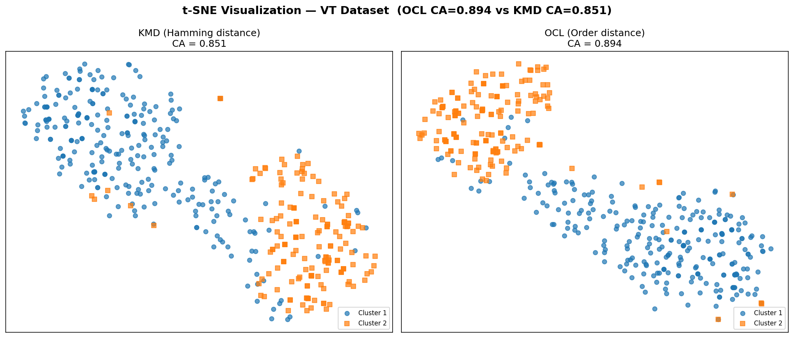
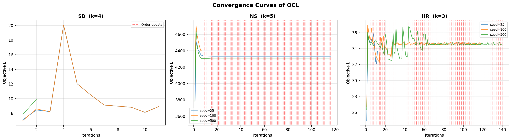

# PPT 素材（11-12 min，Implementation-oriented Project）

> 每页 ≈ 1 分钟，共 11 页

---

## Slide 1: 封面（30s）

**Categorical Data Clustering via Value Order Estimated Distance Metric Learning**

- 论文: arXiv 2411.15189v5
- 原始实现: MATLAB → 我们: **Python 复现 + 扩展**
- Implementation-oriented Project

---

## Slide 2: Outline（15s）

1. Background — 分类数据聚类的难点
2. Problem — 论文要解决什么问题
3. Algorithm — OCL 怎么做
4. Our Implementation — 我们做了什么
5. Experiments — 结果
6. Summary — 优缺点 & 总结

---

## Slide 3: Background（1min）

**分类数据 vs 数值数据**

| 数值数据 | 分类数据 |
|---------|---------|
| 有天然距离 (3 离 8 比 3 离 100 近) | 没有距离概念 |
| k-means 直接用欧氏距离 | "猫"和"狗"有多近？ |

**传统方案**: k-modes 用 Hamming 距离 → 相同=0, 不同=1
**问题**: 所有不同值距离都是 1，丢失了语义

> 例: {猫, 狗, 飞机} → 猫-狗 和 猫-飞机 距离都是 1
> 但实际上猫和狗比猫和飞机更相关

**论文核心 idea**: 给分类属性的值**学一个顺序**，排序后相邻的值更相似

---

## Slide 4: Problem Definition（1min）

**形式化定义**:

- 输入: 分类数据矩阵 X (n 样本 × s 属性)，聚类数 k
- 目标: 最小化簇内距离

**核心创新 — Order Distance**:

论文给每个属性的值学一个排列顺序，排序后相邻值的距离更小（等距量化），从而建立类似数值数据的距离空间。

**动机**: 论文 Figure 1 展示了 WO（无顺序）、SO（语义顺序）、RO（随机顺序）的聚类准确率对比——证明了好的 value order 能大幅提升聚类效果。

> 📄 论文 Figure 1（三种 order 策略的 CA 对比）、Figure 2（order learning 过程示意）

**要解决的问题**: 如何从数据中自动学到这个顺序？

---

## Slide 5: Algorithm — OCL（1.5min）

**两阶段迭代**:

- **内循环**: 固定 value order → 用 order distance 聚类（类似 k-modes，但距离基于 order）
- **外循环**: 根据聚类结果 → 学习新的 value order → 重新编码数据

重复直到聚类结果不再变化。

**两个关键组件**:
1. **Order Distance**: 排序后的值间距 = `|i-j|/(m-1)`（等距量化）
2. **Order Learning**: `significance(v) = P(v|cluster) / expected_distance(v)` → 交错排序

> 📄 论文 Figure 2（order learning 过程: 值密度→排序→线性组合）、Figure 3（SB/NS/HR 收敛曲线，蓝三角=order update，红方块=收敛点）

---

## Slide 6: Our Implementation（1min）

| 层面 | 内容 |
|------|------|
| **算法** | Python 完整复现 OCL，MATLAB → Python 逐函数迁移 |
| **指标** | CA, ARI, NMI, CMP（4 指标全覆盖） |
| **消融** | 算法层面 OCL-I/II/III + 数据层面 LNRO/RNRO |
| **统计** | Wilcoxon signed-rank test |
| **可视化** | t-SNE、learned orders、收敛曲线 |

---

## Slide 7: Experiments — 主结果（1min）

**12 数据集平均**:

| 方法 | CA | ARI | NMI | CMP↓ |
|------|-----|------|------|------|
| KMD（传统 Hamming） | 0.588 | 0.197 | 0.220 | 0.655 |
| **OCL（论文）** | **0.651** | **0.273** | **0.276** | **0.618** |

**结论**: OCL 全面超过传统 KMD（CA +0.064, ARI +0.076）

**与论文对比**: CA 平均差 0.023，CMP 平均差 0.011 → **成功复现**

---

## Slide 8: Experiments — 消融 & 统计（1min）

**消融实验 — 每个组件值多少？**

| 拆除 | CA 损失 | 解读 |
|------|---------|------|
| 概率加权距离 | **-0.034** | ⭐ 最大贡献 |
| 迭代更新 order | -0.010 | |
| Order 信息本身 | -0.020 | |

**名义/有序属性消融 (Table 10)**:

| 变体 | 做法 | 结果 |
|------|------|------|
| LNRO | 只对名义属性学 order | OCL > LNRO 在 8/9 数据集 |
| RNRO | 名义用 Hamming，有序用自然 order | LNRO > RNRO 在 7/9 数据集 |

→ 与论文完全吻合，验证了名义属性也包含可学的 order 信息

**Wilcoxon 检验** (p < 0.05):

| OCL 显著优于 KMD | **8 / 12** |
| OCL 显著劣于 KMD | **0 / 12** |

---

## Slide 9: Experiments — 深度分析（1min）

**发现 1: 并非所有数据集都受益**
- DS: OCL = KMD（order learning 未生效，5 个二值属性 + k=2）
- HR: OCL CA 反而略低（0.36 < 0.38），学到的 order 对 CA 不利

**发现 2: Learned Orders 有意义**（论文 Figure 6 案例）

HR 数据集 (Hobby = {chess, sport, stamp}): OCL 学到 sport > chess > stamp，将更有区分度的值提前。

> 📄 论文 Figure 6: HR 案例研究

**发现 3: 聚类可视化**（论文 Figure 5）

VT 数据集 t-SNE 对比 —— OCL 的 order distance 比 KMD 的 Hamming 距离产生更好的簇分离。

**发现 4: 算法收敛**（论文 Figure 3）

目标函数单调下降，红色虚线标记 order update。

---

## Slide 10: Advantages & Disadvantages（1min）

**OCL 优点**:
- 自动学习 value order，不需要领域知识
- 距离结构更合理，ARI/NMI 提升明显
- 收敛快，参数不敏感
- 可解释性强 — 学到的 order 有语义意义

**OCL 缺点**:
- 对初始化敏感（DS 数据集 seed 不同结果差异大）
- 二值属性多时 order learning 可能不生效
- 需要预知 k（真实类别数）

---

## Slide 11: Summary（30s）

**我们做了什么**:
- ✅ 完整 Python 复现 OCL，4 指标与论文趋势一致
- ✅ 算法消融 (OCL-I/II/III) + 数据消融 (LNRO/RNRO)
- ✅ Wilcoxon 检验证明提升具有统计显著性
- ✅ t-SNE 可视化、HR 案例、收敛曲线

**主要数据**:
| 指标 | 数值 |
|------|------|
| OCL vs KMD CA 提升 | +0.064 |
| 与论文 CMP 平均差 | 0.011 |
| OCL 显著优于 KMD / 显著不如 | 8/12 / **0/12** |