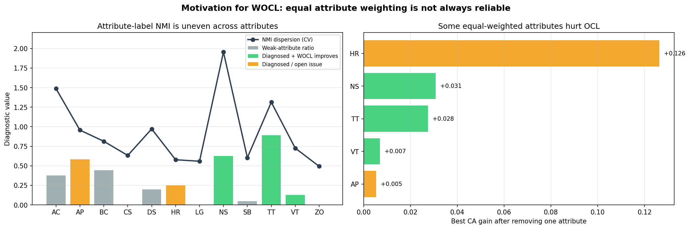
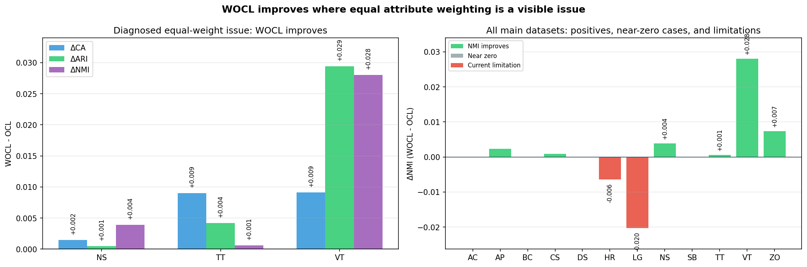

# WOCL PPT 插入材料

> 这份材料用于在 `docs/ppt_report.md` 后面增加 2 页 WOCL 扩展内容。推荐把它放在原 Slide 10 之前或之后：先讲 OCL 的局限，再讲 WOCL 如何针对该局限做小优化。

---

## Slide A: Motivation — OCL 仍然等权看待所有属性

**问题**：

OCL 已经学习了每个属性内部的 value order，但最终距离仍然是所有属性的等权平均：

```text
D(x_i, C_j) = (1/s) * sum_r D_r(x_i, C_j)
```

这意味着 OCL 能回答“同一个属性内的哪些取值更近”，但不能回答“哪个属性更重要”。

如果某些属性是弱属性、噪声属性，或者在类内非常不稳定，等权距离会把它们和有效属性放在同等位置，从而稀释有效属性，甚至误导聚类。

**诊断证据**：

```markdown

```

图中左侧展示每个数据集的属性-label NMI 分布诊断：部分数据集的属性信息量很不均衡，存在较多低 NMI 属性。右侧展示 leave-one-attribute 诊断：在 HR、NS、TT、VT、AP 中，删除某个属性后 OCL 的 CA 反而上升，说明等权属性距离确实可能受到弱属性或误导属性影响。

**讲法建议**：

> 这张图不是训练信号，而是 motivation 诊断。真实标签只用于解释为什么等权属性距离可能存在问题。WOCL 训练时仍然是无监督的。

---

## Slide B: Idea — Attribute-Weighted OCL

**核心想法**：

在 OCL 的 order distance 外层加入自适应属性权重，把等权平均改为加权距离：

```text
D_w(x_i, C_j) = sum_r w_r D_r(x_i, C_j)
```

其中：

```text
w_r >= w_min
sum_r w_r = 1
```

`D_r` 仍然使用 OCL 学到的 probability-aware order distance。WOCL 不推翻 OCL，只是在 OCL 的 value-order learning 之上继续学习属性重要性。

**无监督权重更新**：

```text
G_r = H(p_r) - sum_j pi_j H(p_jr)
S_r = G_r / (H(p_r) + epsilon)
w_r = normalize((S_r + epsilon)^gamma)
```

直觉是：如果一个属性全局很多样，但在每个簇内部比较集中，它对当前聚类有区分作用，应该获得更高权重；如果一个属性在所有簇里的分布差不多，它的权重应该被压低。

当前实现还加入稳定策略：

| 策略 | 作用 |
| --- | --- |
| `weight_delay=1` | 先让 OCL 的 assignment/order 稳定一轮，再更新权重 |
| `weight_mix=0.5` | 距离使用 50% 均匀 OCL 权重 + 50% 学到的 WOCL 权重 |
| `weight_guard=objective` | 如果候选权重让当前 objective 变差，则拒绝更新 |

---

## Slide C: Result — WOCL 在等权风险数据集上有效

**实验设置**：

```text
datasets = 12 main datasets
runs = 30
seed = 25..54
methods = KMD, OCL, WOCL
metrics = CA, ARI, NMI, CMP
```

WOCL 当前配置：

```text
weight_alpha=0.5
weight_gamma=1.0
weight_min=auto
weight_delay=1
weight_mix=0.5
weight_guard=objective
```

**整体主数据集平均**：

| Method | CA↑ | ARI↑ | NMI↑ | CMP↓ |
| --- | ---: | ---: | ---: | ---: |
| KMD | 0.5908 | 0.1998 | 0.2209 | 0.6443 |
| OCL | 0.6500 | 0.2683 | 0.2717 | 0.6117 |
| WOCL | 0.6476 | 0.2678 | 0.2731 | 0.6090 |

解释：

- WOCL 明显优于 KMD；
- WOCL 在 NMI 和 CMP 上超过 OCL；
- WOCL 的 CA/ARI 与 OCL 非常接近；
- 当前不能说 WOCL 全面超过 OCL。

**motivation 指向且 WOCL 正向的数据集**：

| 数据集 | CA Δ | ARI Δ | NMI Δ | 说明 |
| --- | ---: | ---: | ---: | --- |
| NS | +0.0015 | +0.0005 | +0.0039 | 弱属性比例高，等权会稀释有效属性 |
| TT | +0.0090 | +0.0042 | +0.0006 | 多数属性单独信号弱，WOCL 提升稳定性 |
| VT | +0.0091 | +0.0294 | +0.0280 | 少数低价值属性被压低后外部指标提升明显 |

额外正向结果：

| 数据集 | CA Δ | ARI Δ | NMI Δ |
| --- | ---: | ---: | ---: |
| CS | +0.0038 | +0.0020 | +0.0009 |
| ZO | +0.0043 | +0.0093 | +0.0074 |

基本不破坏 OCL：

```text
AC, BC, DS, SB: WOCL 与 OCL 基本持平
```

推荐结果图：

```markdown

```

**讲法建议**：

> WOCL 的结果符合 motivation：在属性等权可能出问题的数据集上，WOCL 能给出正收益；在其他多个主数据集上，WOCL 基本保持 OCL 的表现。当前主要负例是 HR 和 LG，这说明无监督权重更新仍可能被局部聚类结构误导，是后续需要继续优化的部分。

---

## Slide D: Limitation & Next Step

**当前限制**：

| 数据集 | 现象 |
| --- | --- |
| HR | WOCL 低于 OCL，可能是权重更新放大了错误局部结构 |
| LG | WOCL 低于 OCL，是当前主数据集平均被拉低的主要原因 |
| AP | NMI/CMP 改善，但 CA/ARI 下降 |

**后续实验**：

1. 权重诊断：输出 final weights、weight history，并与属性-label NMI、leave-one-attribute 结果对照；
2. 噪声鲁棒性：给数据集追加 10%、25%、50%、100% 随机 categorical noise attributes，比较 OCL 和 WOCL 的性能下降曲线；
3. 稳定性分析：比较 30 次运行的 std(CA/ARI/NMI)、不同运行之间的 pairwise ARI，以及权重收敛情况；
4. 针对 HR/LG：测试更保守的权重接受策略，例如更高 `weight_entropy_min`、更低 `weight_mix` 或更严格 objective guard。

**最终汇报口径**：

```text
WOCL 是对 OCL 的小优化：它保留 OCL 的 value-order learning，
进一步针对“所有属性等权”这一局限加入无监督属性权重。
当前结果显示，WOCL 在等权风险数据集上有效，
在多数其他主数据集上接近 OCL，但还未稳定全面超过 OCL。
```
